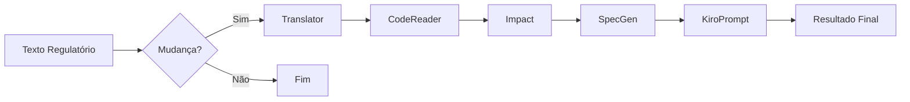

# 🏗️ Arquitetura Técnica - POC Multi-Agent Regulatory AI

## 📊 Visão Geral

Sistema multi-agente baseado em LangGraph que processa textos regulatórios e gera especificações técnicas de implementação através de um pipeline determinístico de 6 agentes especializados.

## 🎯 Objetivos

1. **Automatizar análise** de mudanças regulatórias
2. **Identificar código impactado** via busca semântica
3. **Gerar especificações técnicas** prontas para implementação
4. **Criar prompts** otimizados para desenvolvimento

## 🔧 Stack Tecnológico

### Backend
- **Framework**: FastAPI 0.104+
- **Orquestração**: LangGraph (LangChain)
- **LLM**: Google Gemini 2.5 Flash
- **Embeddings**: sentence-transformers/all-MiniLM-L6-v2
- **Database**: PostgreSQL 15+ com pgvector
- **ORM**: SQLAlchemy 2.0 (async)
- **Validação**: Pydantic v2

### Frontend
- **Framework**: Streamlit 1.28+
- **Visualização**: Mermaid.js (diagramas)
- **HTTP Client**: requests

### Infraestrutura
- **Containerização**: Docker + Docker Compose
- **Proxy**: Nginx (opcional)
- **Cloud**: AWS EC2 (Ubuntu 22.04)

## 🏛️ Arquitetura de Alto Nível

```
┌─────────────────────────────────────────────────────────────┐
│                        Frontend (Streamlit)                  │
│  ┌──────────────┐  ┌──────────────┐  ┌──────────────┐      │
│  │ Input Form   │  │ Results Tabs │  │ Mermaid Graph│      │
│  └──────────────┘  └──────────────┘  └──────────────┘      │
└────────────────────────────┬────────────────────────────────┘
                             │ HTTP/JSON
                             ▼
┌─────────────────────────────────────────────────────────────┐
│                      Backend (FastAPI)                       │
│  ┌──────────────────────────────────────────────────────┐   │
│  │              LangGraph Orchestrator                   │   │
│  │  ┌──────┐  ┌──────┐  ┌──────┐  ┌──────┐  ┌──────┐  │   │
│  │  │Agent1│→ │Agent2│→ │Agent3│→ │Agent4│→ │Agent5│→ │   │
│  │  └──────┘  └──────┘  └──────┘  └──────┘  └──────┘  │   │
│  └──────────────────────────────────────────────────────┘   │
│  ┌──────────────┐  ┌──────────────┐  ┌──────────────┐      │
│  │ LLM Service  │  │Vector Store  │  │ Embeddings   │      │
│  └──────────────┘  └──────────────┘  └──────────────┘      │
└────────────────────────────┬────────────────────────────────┘
                             │
                             ▼
┌─────────────────────────────────────────────────────────────┐
│              PostgreSQL + pgvector Extension                 │
│  ┌──────────────────┐  ┌──────────────────┐                │
│  │ code_embeddings  │  │ audit_logs       │                │
│  │ (vector search)  │  │ (tracking)       │                │
│  └──────────────────┘  └──────────────────┘                │
└─────────────────────────────────────────────────────────────┘
```

## 🤖 Pipeline de Agentes

### Fluxo de Execução



### 1. Sentinel Agent

**Responsabilidade**: Detectar se há mudança regulatória e avaliar risco

**Input**:
- `regulatory_text`: Texto regulatório bruto

**Output**:
- `change_detected`: boolean
- `risk_level`: "low" | "medium" | "high"
- `reasoning`: string

**Implementação**:
```python
# backend/agents/sentinel.py
async def sentinel_agent(state: State) -> dict:
    prompt = f"""
    Analise se o texto representa uma MUDANÇA regulatória:
    {state.regulatory_text}
    
    Retorne JSON:
    {{
        "change_detected": true/false,
        "risk_level": "low/medium/high",
        "reasoning": "..."
    }}
    """
    response = await llm_service.generate(prompt)
    return parse_json(response)
```

**Decisão**: Se `change_detected == False`, pipeline termina aqui.

### 2. Translator Agent

**Responsabilidade**: Extrair modelo estruturado do texto regulatório

**Input**:
- `regulatory_text`: Texto regulatório

**Output**:
- `regulatory_model`: RegulatoryModel
  - `title`: string
  - `description`: string
  - `requirements`: List[string]
  - `effective_date`: Optional[string]

**Implementação**:
```python
# backend/agents/translator.py
async def translator_agent(state: State) -> dict:
    prompt = f"""
    Extraia informações estruturadas:
    {state.regulatory_text}
    
    Retorne JSON:
    {{
        "title": "...",
        "description": "...",
        "requirements": ["req1", "req2"],
        "effective_date": "YYYY-MM-DD"
    }}
    """
    response = await llm_service.generate(prompt)
    return {"regulatory_model": RegulatoryModel(**parse_json(response))}
```

### 3. CodeReader Agent

**Responsabilidade**: Identificar arquivos de código relevantes via busca semântica

**Input**:
- `regulatory_model`: Modelo estruturado
- `repo_path`: Caminho do repositório

**Output**:
- `impacted_files`: List[ImpactedFile]
  - `file_path`: string
  - `similarity_score`: float
  - `content`: string

**Implementação**:
```python
# backend/agents/code_reader.py
async def code_reader_agent(state: State) -> dict:
    # Gerar query de busca
    query = f"{state.regulatory_model.title} {state.regulatory_model.description}"
    
    # Buscar via embeddings
    results = await vector_store.search(
        query=query,
        top_k=10,
        threshold=0.0  # Sempre retorna top 10
    )
    
    # Carregar conteúdo dos arquivos
    impacted_files = []
    for result in results:
        content = read_file(result.file_path)
        impacted_files.append(ImpactedFile(
            file_path=result.file_path,
            similarity_score=result.score,
            content=content
        ))
    
    return {"impacted_files": impacted_files}
```

**Busca Vetorial**:
```sql
-- backend/services/vector_store.py
SELECT 
    file_path,
    content,
    1 - (embedding <=> query_embedding) as similarity
FROM code_embeddings
ORDER BY embedding <=> query_embedding
LIMIT 10;
```

### 4. Impact Agent

**Responsabilidade**: Analisar impacto específico em cada arquivo

**Input**:
- `regulatory_model`: Modelo estruturado
- `impacted_files`: Lista de arquivos

**Output**:
- `impact_analysis`: List[ImpactAnalysis]
  - `file_path`: string
  - `impact_type`: "modification" | "new_feature" | "validation"
  - `affected_components`: List[string]
  - `suggested_changes`: string

**Implementação**:
```python
# backend/agents/impact.py
async def impact_agent(state: State) -> dict:
    analyses = []
    
    for file in state.impacted_files:
        prompt = f"""
        Regulação: {state.regulatory_model.title}
        Requisitos: {state.regulatory_model.requirements}
        
        Código ({file.file_path}):
        {file.content}
        
        Analise o impacto e retorne JSON:
        {{
            "impact_type": "...",
            "affected_components": ["..."],
            "suggested_changes": "..."
        }}
        """
        
        response = await llm_service.generate(prompt)
        analysis = ImpactAnalysis(
            file_path=file.file_path,
            **parse_json(response)
        )
        analyses.append(analysis)
    
    return {"impact_analysis": analyses}
```

### 5. SpecGenerator Agent

**Responsabilidade**: Gerar especificação técnica de implementação

**Input**:
- `regulatory_model`: Modelo estruturado
- `impact_analysis`: Análises de impacto

**Output**:
- `technical_spec`: string (Markdown)

**Implementação**:
```python
# backend/agents/spec_generator.py
async def spec_generator_agent(state: State) -> dict:
    prompt = f"""
    Gere especificação técnica em Markdown:
    
    Regulação: {state.regulatory_model.title}
    Impactos: {format_impacts(state.impact_analysis)}
    
    Estrutura:
    # Especificação Técnica
    ## Objetivo
    ## Arquivos Impactados
    ## Mudanças Necessárias
    ## Testes Requeridos
    ## Riscos
    """
    
    spec = await llm_service.generate(prompt)
    return {"technical_spec": spec}
```

### 6. KiroPrompt Agent

**Responsabilidade**: Criar prompt otimizado para desenvolvimento

**Input**:
- `regulatory_model`: Modelo estruturado
- `impact_analysis`: Análises de impacto
- `technical_spec`: Especificação técnica

**Output**:
- `kiro_prompt`: string

**Implementação**:
```python
# backend/agents/kiro_prompt.py
async def kiro_prompt_agent(state: State) -> dict:
    prompt = f"""
    Crie prompt de desenvolvimento conciso:
    
    Contexto: {state.regulatory_model.title}
    Spec: {state.technical_spec}
    
    Formato:
    "Implemente [objetivo] modificando [arquivos]. 
    Requisitos: [lista]. Testes: [lista]."
    """
    
    kiro_prompt = await llm_service.generate(prompt)
    return {"kiro_prompt": kiro_prompt}
```

## 🔄 Orquestração (LangGraph)

### Definição do Grafo

```python
# backend/orchestrator/graph.py
from langgraph.graph import StateGraph

# Criar grafo
workflow = StateGraph(State)

# Adicionar nós (agentes)
workflow.add_node("sentinel", sentinel_agent)
workflow.add_node("translator", translator_agent)
workflow.add_node("code_reader", code_reader_agent)
workflow.add_node("impact", impact_agent)
workflow.add_node("spec_gen", spec_generator_agent)
workflow.add_node("kiro_prompt_gen", kiro_prompt_agent)

# Definir fluxo
workflow.set_entry_point("sentinel")
workflow.add_conditional_edges(
    "sentinel",
    lambda state: "translator" if state.change_detected else END
)
workflow.add_edge("translator", "code_reader")
workflow.add_edge("code_reader", "impact")
workflow.add_edge("impact", "spec_gen")
workflow.add_edge("spec_gen", "kiro_prompt_gen")
workflow.add_edge("kiro_prompt_gen", END)

# Compilar
app = workflow.compile()
```

### Estado Compartilhado

```python
# backend/models/state.py
from typing import TypedDict, List, Optional

class State(TypedDict):
    # Input
    regulatory_text: str
    repo_path: str
    execution_id: str
    
    # Sentinel
    change_detected: Optional[bool]
    risk_level: Optional[str]
    
    # Translator
    regulatory_model: Optional[RegulatoryModel]
    
    # CodeReader
    impacted_files: List[ImpactedFile]
    
    # Impact
    impact_analysis: List[ImpactAnalysis]
    
    # SpecGen
    technical_spec: Optional[str]
    
    # KiroPrompt
    kiro_prompt: Optional[str]
    
    # Metadata
    timestamp: str
    graph_visualization: Optional[str]
```

## 🗄️ Camada de Dados

### Modelos SQLAlchemy

```python
# backend/database/models.py
from sqlalchemy import Column, String, Float, Text
from pgvector.sqlalchemy import Vector

class CodeEmbedding(Base):
    __tablename__ = "code_embeddings"
    
    id = Column(String, primary_key=True)
    file_path = Column(String, nullable=False, index=True)
    content = Column(Text, nullable=False)
    embedding = Column(Vector(384), nullable=False)  # all-MiniLM-L6-v2
    created_at = Column(DateTime, default=datetime.utcnow)

class AuditLog(Base):
    __tablename__ = "audit_logs"
    
    id = Column(String, primary_key=True)
    execution_id = Column(String, nullable=False, index=True)
    agent_name = Column(String, nullable=False)
    input_data = Column(JSON)
    output_data = Column(JSON)
    duration_ms = Column(Float)
    timestamp = Column(DateTime, default=datetime.utcnow)
```

### Vector Store Service

```python
# backend/services/vector_store.py
class VectorStoreService:
    async def search(
        self,
        query: str,
        top_k: int = 10,
        threshold: float = 0.0
    ) -> List[SearchResult]:
        # Gerar embedding da query
        query_embedding = self.embedding_service.generate(query)
        
        # Buscar no PostgreSQL
        async with self.session() as session:
            results = await session.execute(
                select(
                    CodeEmbedding.file_path,
                    CodeEmbedding.content,
                    (1 - CodeEmbedding.embedding.cosine_distance(query_embedding)).label("similarity")
                )
                .order_by(CodeEmbedding.embedding.cosine_distance(query_embedding))
                .limit(top_k)
            )
            
            return [
                SearchResult(
                    file_path=row.file_path,
                    content=row.content,
                    score=row.similarity
                )
                for row in results
                if row.similarity >= threshold
            ]
```

## 🔌 API REST

### Endpoints

```python
# backend/main.py
from fastapi import FastAPI, Header

app = FastAPI(title="Regulatory AI API")

@app.post("/analyze")
async def analyze(
    request: AnalyzeRequest,
    x_gemini_api_key: Optional[str] = Header(None)
) -> AnalyzeResponse:
    """
    Analisa texto regulatório e retorna especificação técnica.
    
    Headers:
        X-Gemini-API-Key: Chave API do Gemini (opcional, override)
    
    Body:
        regulatory_text: Texto regulatório
        repo_path: Caminho do repositório (default: /app/fake_pix_repo)
    
    Returns:
        Resultado completo da análise multi-agente
    """
    # Override API key se fornecida
    if x_gemini_api_key:
        os.environ["GEMINI_API_KEY"] = x_gemini_api_key
    
    # Executar pipeline
    result = await orchestrator.run(
        regulatory_text=request.regulatory_text,
        repo_path=request.repo_path
    )
    
    return AnalyzeResponse(**result)

@app.get("/health")
async def health():
    return {"status": "ok"}
```

## 🎨 Frontend (Streamlit)

### Estrutura

```python
# frontend/app.py
import streamlit as st

def main():
    st.title("🤖 Regulatory AI - POC")
    
    # Input
    with st.expander("⚙️ Configurações (Opcional)"):
        gemini_key = st.text_input("Gemini API Key", type="password")
    
    regulatory_text = st.text_area("Texto Regulatório", height=200)
    
    if st.button("Analisar"):
        # Chamar API
        response = requests.post(
            f"{BACKEND_URL}/analyze",
            json={"regulatory_text": regulatory_text},
            headers={"X-Gemini-API-Key": gemini_key} if gemini_key else {}
        )
        
        results = response.json()
        
        # Renderizar tabs
        render_results_tabs(results)

def render_results_tabs(results):
    tab1, tab2, tab3, tab4, tab5 = st.tabs([
        "📋 Modelo Regulatório",
        "💻 Impacto no Código",
        "📝 Especificação Técnica",
        "🚀 Prompt Final",
        "📊 Fluxo de Execução"
    ])
    
    with tab1:
        render_regulatory_model(results)
    # ... outros tabs
```

## 🔐 Segurança

### Autenticação
- API Key via header `X-Gemini-API-Key`
- Suporta override por request (útil para POC)

### Validação
- Pydantic v2 para validação de schemas
- FastAPI valida automaticamente requests

### Secrets
- `.env` para configuração
- Nunca commitado no Git
- `.env.example` como template

## 📊 Observabilidade

### Logging

```python
# backend/services/audit.py
class AuditService:
    async def log_agent_execution(
        self,
        execution_id: str,
        agent_name: str,
        input_data: dict,
        output_data: dict,
        duration_ms: float
    ):
        log = AuditLog(
            id=str(uuid.uuid4()),
            execution_id=execution_id,
            agent_name=agent_name,
            input_data=input_data,
            output_data=output_data,
            duration_ms=duration_ms
        )
        await self.session.add(log)
        await self.session.commit()
```

### Métricas
- Tempo de execução por agente
- Taxa de sucesso
- Número de arquivos impactados
- Similaridade média

## 🚀 Performance

### Otimizações

1. **Async/Await**: Todas operações I/O são assíncronas
2. **Connection Pooling**: SQLAlchemy com pool de conexões
3. **Caching**: Embeddings são pré-computados
4. **Batch Processing**: Múltiplos arquivos processados em paralelo

### Benchmarks

- **Sentinel**: ~2s
- **Translator**: ~3s
- **CodeReader**: ~2s (busca vetorial)
- **Impact**: ~5s (depende de arquivos)
- **SpecGen**: ~2s
- **KiroPrompt**: ~1s
- **Total**: ~15-20s

## 🔮 Próximas Melhorias

1. **Cache de LLM**: Redis para respostas repetidas
2. **Streaming**: SSE para feedback em tempo real
3. **Paralelização**: Impact Agent processar arquivos em paralelo
4. **Fine-tuning**: Modelo customizado para domínio regulatório
5. **Multi-tenancy**: Suporte a múltiplos usuários/organizações
6. **Webhooks**: Notificações de conclusão
7. **Versionamento**: Histórico de análises
8. **A/B Testing**: Comparar diferentes prompts/modelos
